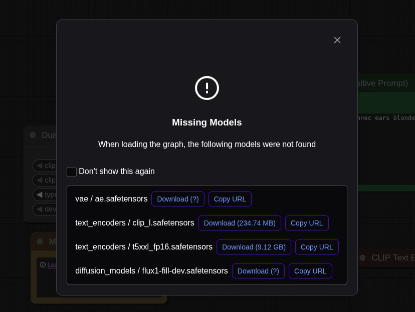

# ComfyUI Docker Deployment

This project provides a robust Docker and Docker Compose configuration for quickly deploying [ComfyUI]. It is pre-configured for full data persistence and NVIDIA GPU acceleration, creating a stable and productive environment.

---

## Prerequisites

- Docker & Docker Compose
- An NVIDIA GPU
- The appropriate NVIDIA drivers installed for your Linux distribution
- The NVIDIA Container Toolkit

---

## Project Structure

- **Dockerfile**: The recipe for building the ComfyUI Docker image.
- **docker-compose.yml**: The orchestration file that defines how to run the container, which ports to expose, and how to link directories for data persistence.
- **.env**: An environment file for variables used by Docker Compose.
- **run.sh**: A convenience script for launching the application.
- **ComfyUI_data/**: The most important directory. This is the folder on your host machine that serves as the permanent storage for all your ComfyUI data.
- **filebrowser_data/**: Stores persistent data and configuration for the Filebrowser service (database and settings).

---

### Detailed Breakdown of the `ComfyUI_data` Contents

- **models/**: This is the heart of your ComfyUI setup. You will place all your model files here, such as:
  - *Checkpoints*: `models/checkpoints/your_model.safetensors`
  - *LoRAs*: `models/loras/your_lora.safetensors`
  - *VAEs*: `models/vae/your_vae.pt`
  - *ControlNet Models*: `models/controlnet/your_controlnet.pth`
  - And any other model types.
- **input/**: Place any images you want to use as inputs for your workflows (e.g., for img2img, ControlNet, or loading reference images) in this directory.
- **output/**: ComfyUI will save all your generated images, videos, and other outputs here. Your results will be safely stored on your host machine.
- **custom_nodes/**: A critical folder for extensibility. When you install third-party nodes (e.g., via `git clone`), they live here. Persisting this folder saves you from having to reinstall all your extensions every time you restart or update the container.
- **comfyui_config.json**: This small but important file stores your personal UI settings, such as enabled options, the last used workflow, and other configuration tweaks. Persisting it makes your user experience seamless.

---

### Detailed Breakdown of the `filebrowser_data` Contents

- **database/**: Contains the Filebrowser SQLite database file (`filebrowser.db`) for user and file metadata.
- **config/**: Stores Filebrowser configuration files (such as `settings.json`).

---

## Installation and Setup

### Step 1: Install the NVIDIA Container Toolkit

*(This section contains the standard procedure for enabling GPU access in Docker).*

**Add the NVIDIA repository (for Debian/Ubuntu):**

```bash
curl -fsSL https://nvidia.github.io/libnvidia-container/gpgkey | sudo gpg --dearmor -o /usr/share/keyrings/nvidia-container-toolkit-keyring.gpg \
&& curl -s -L https://nvidia.github.io/libnvidia-container/stable/deb/nvidia-container-toolkit.list | \
sed 's#deb https://#deb [signed-by=/usr/share/keyrings/nvidia-container-toolkit-keyring.gpg] https://#g' | \
sudo tee /etc/apt/sources.list.d/nvidia-container-toolkit.list
```

**Install the packages:**

```bash
sudo apt-get update
export NVIDIA_CONTAINER_TOOLKIT_VERSION=1.17.8-1
  sudo apt-get install -y \
      nvidia-container-toolkit=${NVIDIA_CONTAINER_TOOLKIT_VERSION} \
      nvidia-container-toolkit-base=${NVIDIA_CONTAINER_TOOLKIT_VERSION} \
      libnvidia-container-tools=${NVIDIA_CONTAINER_TOOLKIT_VERSION} \
      libnvidia-container1=${NVIDIA_CONTAINER_TOOLKIT_VERSION}
```

**Configure and restart Docker:**

```bash
sudo nvidia-ctk runtime configure --runtime=docker
```

Or 

```bash
sudo tee /etc/docker/daemon.json > /dev/null <<EOF
{
    "default-runtime": "nvidia",
    "runtimes": {
        "nvidia": {
            "path": "nvidia-container-runtime",
            "runtimeArgs": []
        }
    }
}
EOF
```

Then restart docker 

```bash
sudo systemctl restart docker
```

For Rootless docker container runtime mode check 

```url
https://docs.nvidia.com/datacenter/cloud-native/container-toolkit/latest/install-guide.html
```  

---

### Step 2: Clone and Prepare the Project

**Clone this repository:**

```bash
git clone https://github.com/EugeneTasks/docker-comfyui.git
cd docker-comfyui
```

**Set Permissions (Crucial Step!):**

```bash
sudo chmod -R 777 ComfyUI_data/
```
```bash
sudo chmod -R 777 filebrowser_data/
```
**Create the required host directories:**

Create further structure (such as `ComfyUI_data/models/checkpoints`, `ComfyUI_data/models/loras`, etc.) as needed following the instructions of ComfyUI. In the example below you need to create a `vae`, `text_encoders` and `diffusion_models` folders in `ComfyUI_data/models` dir



---

### Step 3: Launch ComfyUI

After completing the setup, launch the application using Docker Compose.

```bash
docker-compose up -d --build
```

- `--build`: This flag rebuilds the image if you've made changes to the Dockerfile.
- `-d`: This flag runs the container in detached mode (in the background).

